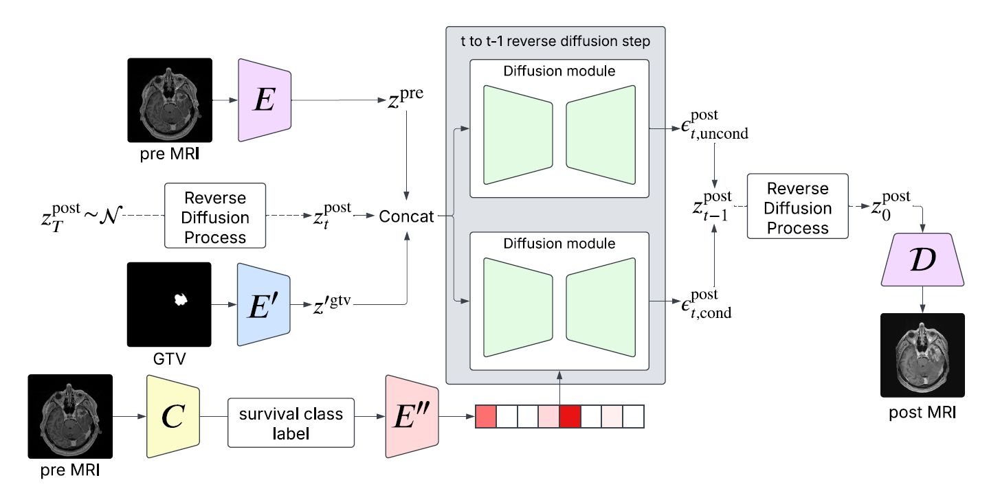

## Introduction

[](https://arxiv.org/pdf/2510.17851)
&nbsp;&nbsp;&nbsp;
[](https://doi.org/10.1007/978-3-032-05472-2_18)
&nbsp;&nbsp;&nbsp;


This is the code of our paper [Pre to Post-Treatment Glioblastoma MRI Prediction using a Latent Diffusion Model](https://arxiv.org/pdf/2510.17851) (presented at the MICCAI workshop DGM4MICCAI 2025).



### Citation
```
@inproceedings{leclercq2025pre,
  title={Pre to Post-treatment Glioblastoma MRI Prediction Using a Latent Diffusion Model},
  author={Leclercq, Alexandre G and Bougleux, S{\'e}bastien and Moreau, No{\'e}mie N and Desmonts, Alexis and H{\'e}rault, Romain and Corroyer-Dulmont, Aur{\'e}lien},
  booktitle={MICCAI Workshop on Deep Generative Models},
  pages={182--191},
  year={2025},
  organization={Springer}
}
```

## Installation Guide:

### Install poetry
```shell
pip install poetry==2.0
```

### Install environment
```shell
poetry install
```

## Usefull command:
### autoencoder:
```shell
python run.py -t -b ./config/vqgan/vqgan.yaml -n "vqgan_pre_post"
```
### LDM:
#### image_to_image:
```shell
python run.py -t -b ./config/ldm/image_2_image_noisy_src_free_guidance_2c_classifier.yaml -n "ldm"
```

### resume training:
```shell
python run.py -t -r "./logs/<model_dir>"
```

### test model:
```shell
python run.py -r  "./logs/<model_dir>" --trials=1 --checkpoint-test=""
```

### tensorboard:
```shell
python -m tensorboard.main --logdir="./logs/<model_dir>"
```

